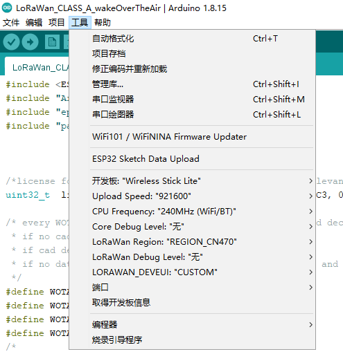
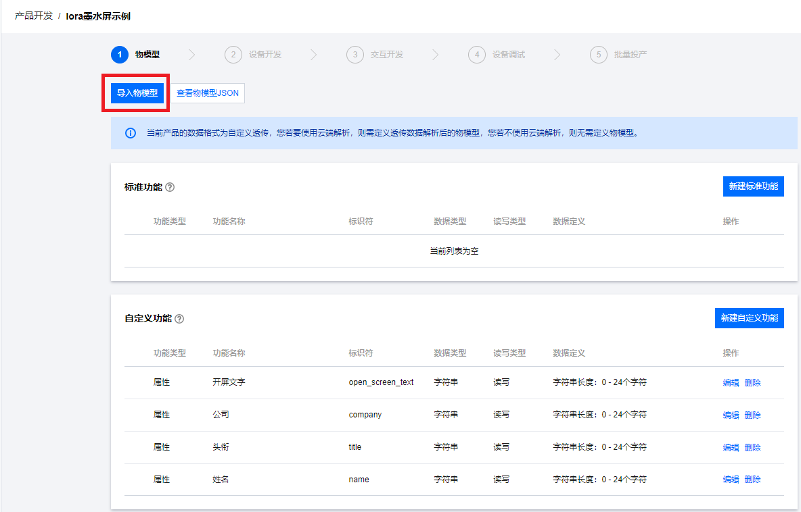
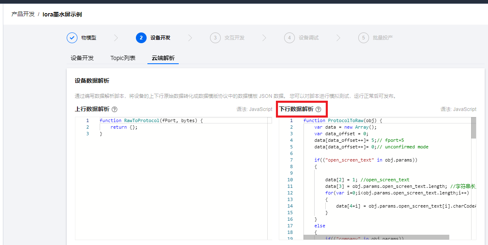
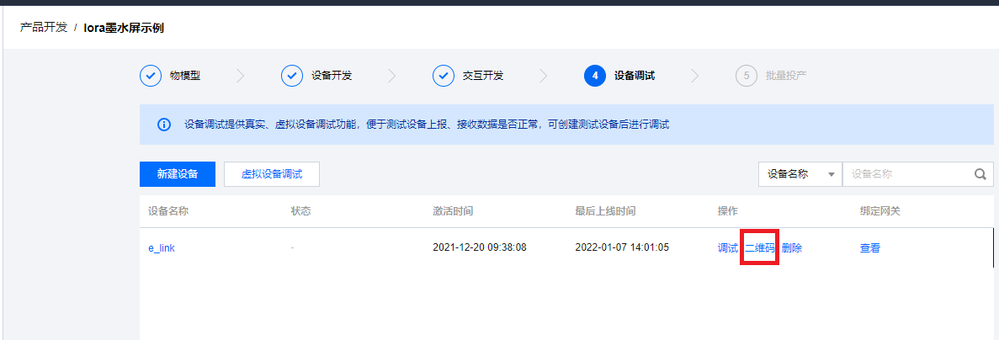
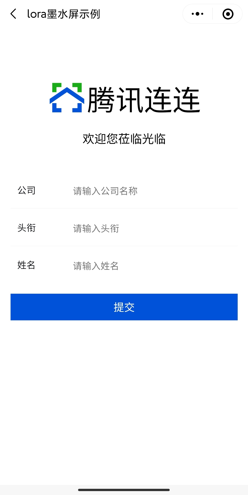

<<<<<<< HEAD
# DIY电子工牌
## 开发环境搭建
1. [搭建Arduino开发环境。](https://heltec-automation.readthedocs.io/zh_CN/latest/general/how_to_install_git_and_arduino.html)   
2. [安装开发框架。](https://heltec-automation.readthedocs.io/zh_CN/latest/esp32/quick_start.html#git)   
3. 用 [boards.txt](./data_decode/boards.txt) 替换**Arduino\hardware\heltec\esp32** 文件夹下的 boards.txt。
## 使用演示
### 开发板基本使用
1. 打开 **LoRaWan_CLASS_A_wakeOverTheAir.ino** 示例，并按照图片进行配置。
2. 连接上串口之后，点击下载，把需要运行的程序下载进去。
3. 如果提示需要license，打开对应[网址](http://resource.heltec.cn/search),查询并输入即可。
4. 正常运行之后，串口会打印 **Within 10 seconds, send any data to the serial port and enter the configuration mode.** 在10S内向串口发送任何数据，都可以进入配置模式。如果不发送，等10S之后，就会进入正常运行。（程序只有在复位之后的第一次运行才会等待10S，后面不会再次等待。）
5. 进入配置模式之后，可以按照一下格式，对下面三项参数进行配置。
>- dev_eui=2232330000888801
>- app_key=88888888888888888888888888886601
>- qrcode_info={"DeviceName":"e_link","ProductId":"WR00ATPGRU","Signature":"a83aaa9708a54790ae020dfa809ca998"}
6. 配置完成之后，复位即可正常进行使用。
### 使用腾讯连连进行远程控制
1. 参看 [LoRaWAN开发文档](https://cloud.tencent.com/document/product/1081/52426) 在腾讯云服务器上面添加网关和节点信息。
2. 将[物模型json文件](./decode/decode.json)，导入物模型。如图
3. 将[数据解析文件](./data_decode/decode.js)内容，复制到下行数据解析栏。如图：
4. 在小程序面板配置界面，选择H5自定义面板，并把[JS文件](./data_decode/SummitInfo_panel-default.c1a671ab6c.js)和[CSS文件](./data_decode/1_SummitInfo_panel-default.8a85310b27.css)导入到相对应的位置。
5. 在微信里面打开腾讯连连小程序，扫描腾讯云网页上面的二维码进入腾讯连连小程序的下发界面。在连接lora 入网之后，就可以进行下发，并显示到墨水屏上面了。   
注：也可以把上面的二维码解析出来，然后通过串口配置，显示到墨水屏上面。然后再使用腾讯连连小程序进行扫描。
=======
# Linux_LoRaWAN  

[English](README.md) |中文  

<!-- ALL-CONTRIBUTORS-BADGE:START - Do not remove or modify this section -->
[](#contributors-)
<!-- ALL-CONTRIBUTORS-BADGE:END -->

---------------------------------------
## 目录
- [Linux_LoRaWAN](#linux_lorawan)
  - [目录](#目录)
  - [项目介绍](#项目介绍)
  - [安装](#安装)
  - [使用](#使用)
  - [许可证验证](#许可证验证)
  - [项目的基本结构](#项目的基本结构)
  - [目前支持频段](#目前支持频段)
  - [添加自己的功能模块](#添加自己的功能模块)
  - [添加图形配置界面选项](#添加图形配置界面选项)
  - [维护者](#维护者)
  - [贡献](#贡献)
  - [贡献者](#贡献者)
  - [执照](#执照)

--------------------------------------- 
## 项目介绍 
>- Linux 下 **LoRaWAN** 应用的实现，支持 LoRaWAN1.02 协议
>- 支持多个[频段](#目前支持频段)
>- 使用 **cmake** 构建,可轻松添加自己的应用代码  
>- 支持**图形化界面**进行参数的配置 [跳转测试](#1)

---------------------------------------
## 安装
1. 首先需要安装 make、camke、gcc。
2. 下载源代码到本地。
3. 进入该项目下的 build 文件夹,依次执行下面命令。
```sh
rm -rf *
cmake ..
make
```
4. 执行完成之后，将会在 bin 文件夹里面生成可执行文件。 
## 使用
1. 在该项目的 build 文件夹下使用如下命令进行配置。
```sh
make menuconfig
```
2. 进入该项目的 bin 文件夹,执行启动命令。
```sh
./demo
```
3. 如果遇到 **Certificate verification failed** 请参看[许可证验证](#许可证验证)
## 许可证验证
一般，我们都会直接将许可证保存在文件 /project/config/config.ini ,用户无需再自己查找许可证，但是可能存在文件信息被误删、误改的情况。若果出现验证不通过，就可以参看这一章节。
1. 首先需要确保网线是插好的。
2. 使用一下命令获取eth的MAC地址。
```sh
ifconfig
```
3. 一般获取的MAC地址如第一行，去掉冒号( **:** )之后，得到需要的产品 ID ，如第二列。
>- ether 02:01:9b:f5:49:49   
>- 02019bf54949         
4. 打开地址连接[获取许可证](https://resource.heltec.cn/search) ，将上一步获取的产品 ID 输入，即可获取到需要许可证（ **license** ）。
5.  使用 shell 命令 lora-config 打开配置界面，找到许可证输入选项，将上述的许可证输入进去。保存退出即可。
>- HelTec LoRaWAN license  --->

---------------------------------------
## 项目的基本结构
```
|-- bin                #可执行文件
|-- build              #构建文件
|-- functional_module  #功能模块
|   |-- bmp180
|   |-- data_conversion
|   |-- fifo
|   |-- hdc1080
|   `-- lora
|-- hardware_driver   #驱动模块
|   |-- gpio
|   |-- i2c
|   `-- spi
|-- lib              #构建过程中生成的中间库
`-- project          
    |-- config       #配置相关文件
    `-- main         #主函数
```

---------------------------------------
## 目前支持频段  
 >- [x] AS923 region
 >- [x] AU915 region
 >- [x] CN470 region
 >- [x] CN779 region
 >- [x] EU433 region
 >- [x] EU868 region
 >- [x] KR920 region
 >- [x] IN865 region
 >- [x] US915 region
 >- [x] US915_HYBRID region
 >- [ ] AU915 SB2 region
 >- [x] AS923 AS1 region
 >- [x] AS923 AS2 region

---------------------------------------
## 添加自己的功能模块
**以bmp180为例**
1. 在 functional_module 文件夹下添加新建文件名为 bmp180 的文件夹。
2. 在 bmp180 文件夹下添加如下文件  
> bmp180.c     
> bmp180.h  
> CMakeLists.txt   
> README.md
3. 编写源文件和头文件内容。
4. 编写CMakeList.txt
```cmake
#添加源文件
aux_source_directory(. BMP180)
#添加需要包含的头文件
include_directories(${PROJECT_SOURCE_DIR}/hardware_driver/i2c)
#添加链接库的路径
link_directories(${PROJECT_SOURCE_DIR}/lib)
#添加数学计算库
LINK_LIBRARIES(-lm)
#链接生成静态库
add_library(bmp180 ${BMP180} )
#将i2c的库链接进来
target_link_libraries(bmp180 i2c )
#设置将当前文件夹作为依赖model1库的头文件的搜索目录
target_include_directories(bmp180 PUBLIC ${CMAKE_CURRENT_SOURCE_DIR})
```
5. 编写 `README.md` 说明文档 。
6. 在 functional_module/CMakeLists.txt 添加
```cmake
#添加子目录并构建子目录
add_subdirectory(bmp180)
```
7. 在 project/main/CMakeLists.txt 的链接库选项添加 bmp180
```cmake
target_link_libraries(${PROJECT_NAME} fifo config lora hdc1080 bmp180 data_conversion)
```
8. 在 main.c 里面面添加自己 bmp180 的头文件，即可调用 bmp180 函数了。

---------------------------------------
## 添加图形配置界面选项
1. 找到项目的 Kconfig 文件,在 LORAWAN_APP_DATA 菜单栏里面添加
```kconfig
config BMP180_DATA
    bool "bmp180"
```
2. 在 project/config/config.ini 的 LORAWAN_DATA_SELECTION 菜单栏里面添加
```ini
;BMP180_DATA=3
```
- 这个选项的名字和 Kconfig 里面的选项需要一致，都是 **BMP180_DATA** 。
- 这个选项的数值需要和 main.c 里面准备数据的选项进行配合,其数值都是等于**3**
```c。
typedef enum 
{
    fixed_data =0,
    mkfifo_data,
    hdc1080_data,
    bmp180_data
}data_selection_num;
```
3.  在 project/config/kconfig_lib/configini_to_kconfig.sh 的 #Configure LoRaWAN upload data selection 里面添加
```sh
elif [ $DATA_SELECTION -eq 3 ];then
    echo "CONFIG_BMP180_DATA=y" >> $K_CONFIGFILE
```
- configini_to_kconfig.sh 会同步 C 配置文件去图形界面配置文件。
4. 此次添加的 bmp180 配置选项不需要去修改 project/config/kconfig_lib/kconfig_to_configini.sh 文件，因为之前的同步选项已经匹配了 bmp180 。
- kconfig_to_configini.sh 会同步图形界面配置文件去 C 配置文件。

5. 在  project/main/main.c 里面添加读取 config.ini 文件。
```c
    data_selection = iniparser_getint(ini,"LORAWAN_DATA_SELECTION:data_selection",-1);
```
6. 使用 make menuconfig 去配置 bmp180 选项并保存，这时候在main.c里面读取出来 data_selection = 3 。

7. 添加完成，可以在 man.c 里面去通过选项实现相关功能。

---------------------------------------
## 维护者
[@Quency-D](https://github.com/RichardLitt)

---------------------------------------
## 贡献
非常欢迎你的加入！[提一个 Issue](https://github.com/RichardLitt/standard-readme/issues/new) 或者提交一个 Pull Request。


标准 Readme 遵循 [Contributor Covenant](http://contributor-covenant.org/version/1/3/0/) 行为规范。

---------------------------------------
## 贡献者 
感谢以下参与项目的人：
<!-- ALL-CONTRIBUTORS-LIST:START - Do not remove or modify this section -->
<!-- prettier-ignore-start -->
<!-- markdownlint-disable -->
<table>
  <tr>
    <td align="center"><a href="https://github.com/Luckybuyu"><br /><sub><b>Luckybuyu</b></sub></a><br /><a href="#design-Luckybuyu" title="Design">🎨</a></td>
    <td align="center"><a href="https://heltec.org"><br /><sub><b>Aaron.Lee</b></sub></a><br /><a href="https://github.com/Quency-D/linux_lora/commits?author=Heltec-Aaron-Lee" title="Code">💻</a></td>
  </tr>
</table>

<!-- markdownlint-restore -->
<!-- prettier-ignore-end -->

<!-- ALL-CONTRIBUTORS-LIST:END -->

---------------------------------------
## 执照
[MIT](LICENSE)
[1]. helll
>>>>>>> 67ff3b883e977b813d027b3280778c9ecff7bcd0
